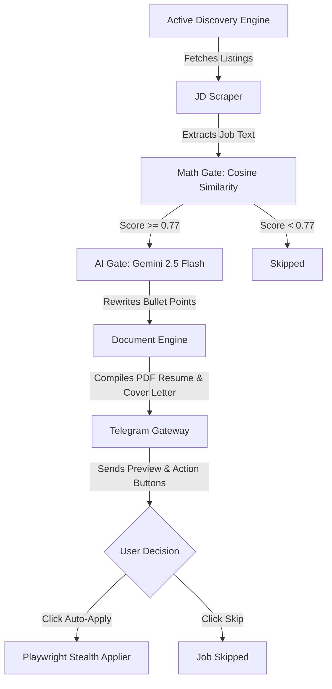

# 🤖 JAS: Job Application System (The Anti-ATS Agent)

**JAS (Job Application System)** is a powerful, autonomous AI agent designed to turn the tables on automated Applicant Tracking Systems (ATS). Instead of spending hours matching keywords, tailoring resumes, and filling out endless web forms, JAS does it all for you on auto-pilot. 

You control the entire system from a simple, 1-tap Telegram bot interface.

---

## 🌟 Key Features

*   **🔍 Active Discovery Engine**: Periodically checks trusted job platforms (YC Startup Jobs, Internshala, and Hacker News RSS) automatically for new listings.
*   **📐 Zero-Memory Math Gate**: Uses Google's Gemini Embeddings to instantly and cheaply calculate the similarity between your resume and a job description. This runs entirely in the cloud, preventing out-of-memory crashes on cheap servers.
*   **🧠 Gemini AI Tailoring**: Automatically reads the job description, analyzes what the employer wants, and rewrites your resume's bullet points to match using Gemini 2.5 Flash.
*   **📄 PDF Document Engine**: Compiles your tailored resume into an ATS-friendly, clean single-column PDF using LaTeX/Tectonic. It also generates a customized Cover Letter for high-match jobs (>= 90%).
*   **🚀 Stealth Auto-Applier**: Uses headless browser automation with `playwright-stealth` to bypass bot-detection scripts (like Cloudflare/Datadome). It dynamically fills fields, answers custom questions using AI, uploads your tailored resume, and submits your application.
*   **📊 Rich Telegram Console**: Uptime tracking, connection health monitoring, manual execution triggers, and custom threshold settings—all managed in one chat.

---

## 🔄 How the Workflow Works



---

## 🛠️ Step-by-Step Setup

Follow these simple steps to set up and run your JAS agent:

### 1. Configure the Environment
Create a `.env` file in the root directory by copying the template:
```bash
cp .env.example .env
```
Fill in the following details inside your new `.env` file:
*   **Supabase Settings**: Your project URL and Service Role Key (used to save profile data and track jobs).
*   **Google Gemini Settings**: Your Gemini API key (for embeddings and resume tailoring).
*   **Telegram Settings**: Your bot token (get this from `@BotFather`) and your Telegram User ID (so the bot only talks to you).

### 2. Set Up the Database
Copy the contents of `src/db/schema.sql` and run them inside your Supabase project's **SQL Editor**. This sets up the required tables and the `pgvector` extension for semantic searches.

### 3. Run the System

#### Option A: Running with Docker (Recommended)
Make sure you have Docker and Docker Compose installed, then run:
```bash
docker-compose up --build
```

#### Option B: Running Locally
Install the dependencies, set up Playwright, and start the FastAPI server:
```bash
# Install packages
pip install -e .[dev]

# Install Playwright browser engines
playwright install chromium

# Start the application
uvicorn src.main:app --host 0.0.0.0 --port 8000
```

---

## 💬 Telegram Bot Commands

Your Telegram bot is your command center. Send it these commands at any time:

*   **`/start`**: Welcome message, lists all available commands, and initializes the conversation.
*   **`/update_resume`**: Hot-swap your master resume. Send this command, then reply to it by uploading your master resume PDF. JAS will parse the text, generate a new embedding vector, and update your baseline profile.
*   **`/run`**: **(Manual Trigger)** Immediately starts the pipeline. It crawls job listings from trusted platforms, scrapes descriptions, tailors documents, and alerts you of matches right away.
*   **`/status`**: Shows whether the bot is online, uptime duration, database connection health, the number of unique websites crawled, and a breakdown of jobs scanned/applied.
*   **`/set_threshold <value>`**: Sets the strictness of the Math Gate (e.g., `/set_threshold 0.80`). Only jobs matching above this cosine similarity score will pass to the AI phase.
*   **`/digest`**: Generates and sends an on-demand daily summary report of your applications.
*   **`/pause`**: Pauses the automatic background job checker.
*   **`/resume`**: Resumes the automatic background job checker (checks every 4 hours).